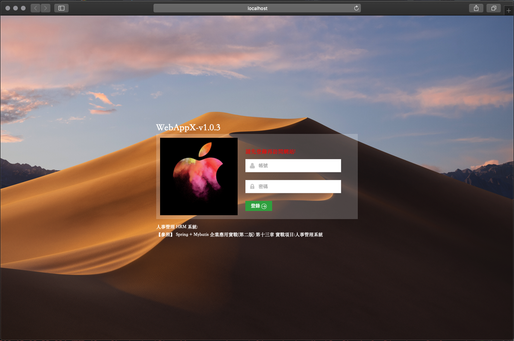
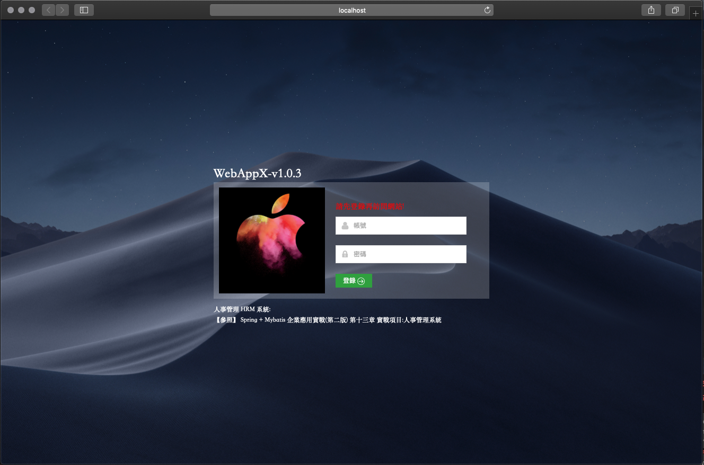

# WebAppX-v1.0.3
Web Spring MVC Framework X Version 1.0.3 ( Spring + MyBatis - 實戰項目 : 人事管理系統 )

## 登入頁面

## Project Setting 

+ Use MySQL DataBase
    + db/ - SQL
    + src/db.properties - database config
+ IDE - Import Project
    + [參考資料](https://github.com/RHZEnoxs/Document/blob/master/Intellij/Import_Project_SpringMVC.md)

## 參考資料來源

Spring + MyBatis 企業應用實戰（第2版），第十三章 - 實戰項目 : 人事管理系統

